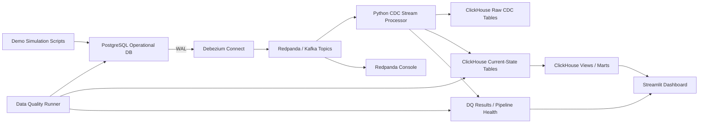

# Real-Time Order & Inventory CDC Platform

A CDC-powered e-commerce analytics platform that turns PostgreSQL row changes into real-time inventory, order, payment, seller, and pipeline health dashboards.

## Problem

Modern commerce teams often make decisions from stale data. Inventory says a product is available after it has already sold out, seller dashboards lag behind orders, payment/refund status arrives late, and analytics teams burn compute on full-refresh jobs.

This project demonstrates a practical alternative: use Change Data Capture to stream inserts, updates, and deletes from PostgreSQL into Redpanda, process the changes incrementally, and serve fresh operational analytics from ClickHouse.

## Business Scenario

The demo company, ShopPulse, is running a flash sale. Orders spike, inventory drops quickly, some payments move from `PENDING` to `SUCCESS`, and a few orders are cancelled or refunded. The CDC platform shows those changes within seconds while a simulated hourly batch snapshot remains stale.

## Architecture



## Tech Stack

- PostgreSQL for transactional source data
- Debezium for WAL-based CDC
- Redpanda for Kafka-compatible streaming
- Python for the MVP stream processor and demo scripts
- ClickHouse for analytical serving
- Streamlit for the local dashboard
- Custom SQL/Python quality checks for MVP trust signals
- Redpanda Console plus ClickHouse health tables for observability

## Local Ports

| Service | Port |
|---|---:|
| PostgreSQL | 5432 |
| Debezium Connect | 8083 |
| Redpanda broker | 9092 |
| Redpanda admin | 9644 |
| Redpanda Console | 8080 |
| ClickHouse HTTP | 8123 |
| ClickHouse native | 9000 |
| Streamlit | 8501 |

## Run Locally

1. Copy environment defaults:

   ```bash
   cp .env.example .env
   ```

2. Start the container runtime.

   Podman:

   ```bash
   podman machine start
   podman info
   ```

   Docker alternative:

   ```bash
   docker info
   ```

3. Start infrastructure:

   ```bash
   podman compose up -d postgres redpanda clickhouse debezium redpanda-console
   ```

   Docker alternative:

   ```bash
   docker compose up -d postgres redpanda clickhouse debezium redpanda-console
   ```

4. Check service health:

   ```bash
   podman compose ps
   curl -fsS http://localhost:8123/ping
   curl -fsS http://localhost:8083/connectors
   podman exec cdc-postgres pg_isready -U cdc_user -d shopdb
   podman exec cdc-redpanda rpk cluster health
   ```

5. Register the Debezium connector:

   ```bash
   ./scripts/register_connector.sh
   ```

6. Confirm topics were created:

   ```bash
   ./scripts/create_topics.sh
   podman exec cdc-redpanda rpk topic list
   ```

7. Start the CDC processor in a dedicated terminal:

   ```bash
   cd stream_processor
   uv run python -m src.main
   ```

8. Start the dashboard in another terminal:

   ```bash
   cd dashboard
   uv run streamlit run app.py
   ```

9. Run a demo simulation from the repo root:

   ```bash
   uv run --project scripts python scripts/simulate_flash_sale.py
   uv run --project scripts python scripts/simulate_payment_updates.py
   uv run --project scripts python scripts/simulate_inventory_changes.py
   uv run --project scripts python scripts/simulate_refunds_and_cancellations.py
   uv run --project scripts python scripts/simulate_delete_handling.py
   ```

   Confirm ClickHouse received CDC events:

   ```bash
   curl -sS "http://localhost:8123/?database=cdc_analytics" --data-binary "SELECT source_table, count() FROM raw_cdc_events GROUP BY source_table ORDER BY source_table"
   ```

10. Run data quality checks:

   ```bash
   cd stream_processor
   uv run python -m src.quality.run_checks
   ```

## Troubleshooting Podman

If `podman machine start` reports success but `podman machine inspect` still shows `State: "stopped"`, the problem is the local Podman VM/socket, not the project compose file.

Try:

```bash
podman machine stop
podman machine start
podman machine inspect
podman info
```

If the socket still fails with `connection refused` or `operation not permitted`, recreate the VM:

```bash
podman machine stop
podman machine rm
podman machine init --cpus 4 --memory 4096 --disk-size 100
podman machine start
podman info
```

If Podman remains blocked, use Docker Desktop:

```bash
docker compose -f compose.yml config
docker compose -f compose.yml up -d
docker compose -f compose.yml ps
```

## Demo Flow

1. Open Streamlit at `http://localhost:8501`.
2. Open Redpanda Console at `http://localhost:8080`.
3. Show baseline GMV, orders, inventory, payments, and freshness.
4. Run the flash sale script.
5. Watch order count and GMV increase.
6. Watch inventory decrease and low-stock products appear.
7. Update payments from `PENDING` to `SUCCESS`.
8. Cancel/refund an order and show revenue adjustments.
9. Inspect raw CDC events in Redpanda Console.
10. Run the delete handling script and show the downstream `is_deleted = 1` row version.
11. Show ClickHouse current-state and pipeline health queries.

## What This Demonstrates

- PostgreSQL WAL capture with Debezium
- Kafka-compatible CDC topics in Redpanda
- Debezium snapshot, insert, update, delete, and tombstone handling
- Idempotent analytical state using ClickHouse immutable inserts
- Real-time dashboard freshness and pipeline health
- Data quality checks for business-critical metrics

## Future Improvements

- Replace or augment Python processing with Flink
- Add dbt models for stronger dimensional modeling
- Add Dagster or Airflow for replay, backfills, and quality schedules
- Add Schema Registry and compatibility rules
- Add Prometheus/Grafana metrics
- Add CI/CD and cloud deployment
