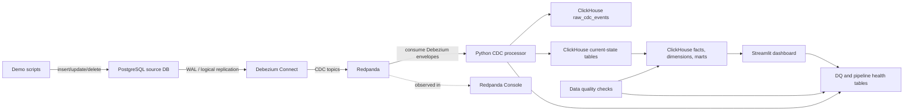

# Real-Time Order & Inventory CDC Platform

[](https://github.com/bulgogipedas/change-data-capture/actions/workflows/validate.yml)

A portfolio-grade data engineering project that captures operational changes from PostgreSQL with Debezium, streams them through Redpanda, processes them incrementally with Python, serves analytical state in ClickHouse, and presents fresh order, payment, refund, seller, inventory, and pipeline health metrics in Streamlit.

## Project Overview

Modern e-commerce companies often have one operational database but many downstream views of the business: seller dashboards, inventory monitoring, finance reports, analytics marts, product availability, and executive dashboards. When those systems depend on hourly batch ETL, they drift away from the source of truth.

This project shows how Change Data Capture solves that problem. Every insert, update, and delete in PostgreSQL becomes an event. Those events flow through Redpanda, are normalized by a Python processor, and land in ClickHouse tables designed for near real-time analytics.

The demo company is **ShopPulse**, a marketplace running a flash sale. During the sale, orders spike, inventory falls quickly, payments change status, and refunds/cancellations happen. The dashboard updates from CDC events instead of waiting for the next batch refresh.

## Why This Problem Matters

In a real commerce operation, stale data creates visible business damage:

- Customers see stock as available, then checkout fails.
- Sellers see outdated revenue and order counts.
- Operations teams miss low-stock incidents.
- Finance teams wait for payment and refund updates.
- Analytics teams run expensive full-refresh jobs to answer questions that only need incremental changes.
- Product/search systems can keep showing inactive or out-of-stock products.

CDC is valuable because it captures what changed, when it changed, and in what order. That makes downstream systems fresher, cheaper to update, easier to audit, and easier to replay.

## Business Impact

| Business area | Batch ETL pain | CDC outcome |
|---|---|---|
| Inventory | Stock dashboards lag behind real sales | Low-stock products surface within seconds |
| Seller operations | Sellers wait for updated orders and revenue | Seller performance reflects current transactions |
| Finance | Payment/refund status arrives late | Payment monitoring tracks status transitions |
| Analytics | Full refreshes scan unchanged data | Incremental updates reduce repeated work |
| Operations | Incident response is delayed | Teams see freshness and pipeline health |

## Architecture



## Tech Stack

| Layer | Tool | Role |
|---|---|---|
| Source database | PostgreSQL | Transactional e-commerce data |
| CDC | Debezium | Reads PostgreSQL WAL and emits row-level changes |
| Streaming | Redpanda | Kafka-compatible event backbone |
| Processing | Python | Parses Debezium events and writes ClickHouse |
| Analytics | ClickHouse | Low-latency analytical tables and marts |
| Dashboard | Streamlit | Demo interface for business and pipeline views |
| Data quality | Python SQL checks | Validates warehouse and mart assumptions |
| Runtime | Podman Compose | Local reproducible service stack |

## Data Flow

1. PostgreSQL stores transactional entities: customers, sellers, products, inventory, orders, payments, shipments, refunds, and stock movements.
2. Debezium snapshots the source tables, then streams `INSERT`, `UPDATE`, and `DELETE` changes from PostgreSQL WAL.
3. Redpanda stores one CDC topic per source table, for example `dbserver1.public.orders`.
4. The Python processor consumes Debezium envelopes, extracts `before`, `after`, `op`, source timestamps, topic, partition, and offset metadata.
5. ClickHouse stores raw CDC events for audit/replay and current-state rows using immutable inserts with versioned replacement.
6. ClickHouse views expose facts, dimensions, and marts for dashboards.
7. Streamlit reads ClickHouse and shows near real-time operational analytics.

## Dashboard Pages

| Page | What it shows | Demo purpose |
|---|---|---|
| Executive overview | GMV, total orders, successful payments, cancellations, refunds, active sellers | Business summary during the incident |
| Real-time inventory | Low-stock products, out-of-stock products, stock movement timeline | Shows inventory changing from sales and adjustments |
| Seller operations | Seller revenue, orders, cancellations, top products | Shows seller-facing operational freshness |
| Payment monitoring | Pending, successful, failed, and refunded payments | Shows payment status transitions |
| CDC pipeline health | Event counts, freshness, failed records, DQ results | Shows trust and observability of the pipeline |

## Repository Structure

See `docs/repository-structure.md` for the cleaned public file layout. The repository intentionally shows only implemented MVP components and portfolio docs; local-only operational runbooks are ignored by git.

## Demo Scenario

The demo is a flash sale incident:

1. Start with baseline inventory and order metrics.
2. Run a flash sale script that inserts a new order, order item, pending payment, inventory update, and stock movement.
3. Show Debezium events appearing in Redpanda topics.
4. Show the Python processor writing raw and current-state events to ClickHouse.
5. Refresh Streamlit and show order count, inventory, and pipeline freshness moving.
6. Mark a payment as successful.
7. Force a low-stock adjustment.
8. Cancel/refund an order.
9. Demonstrate physical delete handling with a shipment insert/delete.
10. Run data quality checks and show all checks passing.

The key contrast: an hourly batch ETL dashboard would still show the old stock and payment state, while this CDC pipeline reflects the incident as it happens.

## Run Locally

Prerequisites:

- Podman and Podman Compose
- `uv`
- `curl`

Validate the project before starting services:

```bash
./scripts/validate_project.sh
```

From the repo root:

```bash
cp .env.example .env
podman machine start
podman info
podman compose -f compose.yml config
podman compose -f compose.yml up -d
podman compose -f compose.yml ps
```

The same commands are available through `make`:

```bash
make help
make validate
make up
make ps
```

Register CDC and ensure all topics exist:

```bash
./scripts/register_connector.sh
./scripts/create_topics.sh
podman exec cdc-redpanda rpk topic list
curl -sS http://localhost:8083/connectors/shop-postgres-source/status
```

Or:

```bash
make register-connector
make create-topics
```

Start the CDC processor in a dedicated terminal:

```bash
cd stream_processor
uv run python -m src.main
```

Start the dashboard in another terminal:

```bash
cd dashboard
uv run streamlit run app.py
```

Open:

- Streamlit dashboard: `http://localhost:8501`
- Redpanda Console: `http://localhost:8080`
- Debezium REST: `http://localhost:8083/connectors`
- ClickHouse HTTP playground: `http://localhost:8123/play`

## Demo Commands

Run the full scripted demo sequence from the repo root while the processor is running:

```bash
./scripts/run_demo_sequence.sh
```

Or:

```bash
make demo
```

Equivalent manual commands:

```bash
uv run --project scripts python scripts/simulate_flash_sale.py
uv run --project scripts python scripts/simulate_payment_updates.py
uv run --project scripts python scripts/simulate_inventory_changes.py
uv run --project scripts python scripts/simulate_refunds_and_cancellations.py
uv run --project scripts python scripts/simulate_delete_handling.py
```

Run data quality checks:

```bash
cd stream_processor
uv run python -m src.quality.run_checks
```

Or:

```bash
make quality
```

## Health Checks

For a quick live demo health report:

```bash
./scripts/check_demo_health.sh
```

Or:

```bash
make health
```

Manual checks:

```bash
podman compose -f compose.yml ps
podman exec cdc-postgres pg_isready -U cdc_user -d shopdb
podman exec cdc-redpanda rpk cluster health
curl -fsS http://localhost:8083/connectors
curl -fsS http://localhost:8123/ping
podman exec cdc-redpanda rpk topic list
```

Verify events in ClickHouse:

```bash
curl -sS "http://localhost:8123/?database=cdc_analytics" \
  --data-binary "SELECT source_table, count() FROM raw_cdc_events GROUP BY source_table ORDER BY source_table"
```

Verify executive mart:

```bash
curl -sS "http://localhost:8123/?database=cdc_analytics" \
  --data-binary "SELECT * FROM mart_executive_overview FORMAT PrettyCompact"
```

## Data Quality Checks

The MVP includes custom SQL checks for:

- Non-negative order totals.
- Non-negative inventory quantity.
- Successful payments requiring `paid_at`.
- Non-zero stock movement quantity.
- Cancelled paid orders being visible for revenue adjustment review.

The checks write results to `data_quality_results`, which is visible on the CDC pipeline health dashboard.

## Helper Scripts

| Script | Mutates data? | Purpose |
|---|---:|---|
| `scripts/validate_project.sh` | No | Static validation for Python syntax, shell syntax, connector JSON, compose YAML, required files, and executable permissions |
| `scripts/check_demo_health.sh` | No | Runtime checks for PostgreSQL, Redpanda, Debezium, ClickHouse, topics, raw CDC counts, marts, and DQ summary |
| `scripts/run_demo_sequence.sh` | Yes | Runs the flash sale, payment update, inventory update, refund/cancellation, and delete demo scripts in order |
| `scripts/register_connector.sh` | Yes | Registers or updates the Debezium PostgreSQL connector |
| `scripts/create_topics.sh` | Yes | Ensures expected Redpanda topics exist, including initially empty tables |

If validation fails, read the first `FAIL` line and fix that before starting the stack. `WARN` lines are usually environment notes, such as `.env` missing or Podman not running.

The repository also includes a small GitHub Actions workflow at `.github/workflows/validate.yml` that runs `scripts/validate_project.sh` on pushes and pull requests. It is intentionally static-only: it does not start containers or require local demo services.

## Screenshots

Recommended screenshots live under `docs/screenshots.md`. Suggested output folder:

```text
docs/assets/screenshots/
```

Capture:

- Executive overview after the full demo.
- Real-time inventory with at least one low-stock product.
- Payment monitoring after payment/refund updates.
- CDC pipeline health with raw event counts and DQ results.
- Redpanda Console topic list.
- Debezium connector `RUNNING` status.
- ClickHouse query output for `raw_cdc_events`.

## Public Documentation

| Document | Purpose |
|---|---|
| `docs/architecture.md` | System architecture and data flow |
| `docs/cdc-design.md` | CDC event handling strategy |
| `docs/data-model.md` | Source and analytical model overview |
| `docs/demo-story.md` | Presenter narrative for the flash sale demo |
| `docs/interview-notes.md` | Interview-ready technical explanations |
| `docs/screenshots.md` | Screenshot capture checklist |
| `docs/repository-structure.md` | Clean public repository structure |

## Known Limitations

This is intentionally an MVP, not a production platform:

- The processor is a Python consumer, not Flink or Kafka Streams.
- Exactly-once semantics are not implemented.
- Schema evolution is documented but not automated.
- Consumer lag is mostly inspected through Redpanda tools, not pushed to a metrics backend.
- The dashboard refresh is manual/page-driven rather than live websocket streaming.
- Reset/replay is manual and documented, not orchestrated.
- Secrets are local demo defaults, not production-grade secret management.

## Future Improvements

- Replace or augment the Python processor with Flink for stateful/event-time processing.
- Add dbt models for stronger staging, facts, dimensions, and marts.
- Add a dead-letter queue and replay tooling.
- Add Schema Registry and compatibility checks.
- Add Dagster or Airflow for backfills and scheduled quality checks.
- Add Prometheus/Grafana for operational metrics.
- Add CI checks for Python, SQL, Compose config, and documentation.
- Deploy a cloud version with managed Postgres, Kafka-compatible streaming, and ClickHouse.

## Interview Talking Points

- CDC is better than hourly batch for operational analytics because it moves row-level changes continuously instead of repeatedly scanning unchanged tables.
- Debezium reads PostgreSQL WAL and emits structured `before`/`after` envelopes with operation metadata.
- Redpanda acts as the durable event log between capture and processing.
- ClickHouse is a strong analytical serving layer because it handles high-volume inserts and fast aggregate queries.
- Deletes are represented downstream with `is_deleted` and raw CDC payloads for auditability.
- Idempotency is approached with Kafka topic/partition/offset metadata and ClickHouse versioned current-state tables.
- Data quality is part of the demo because real-time data is only useful when teams can trust it.
- The MVP trades production complexity for clarity: it is small enough to run locally but realistic enough to discuss production evolution.
