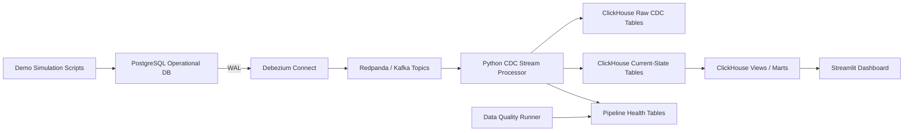

# Architecture

ShopPulse uses PostgreSQL as the operational source of truth. Debezium reads logical changes from the PostgreSQL WAL and publishes one topic per table into Redpanda. A Python processor consumes those CDC events, stores raw payloads, maintains ClickHouse current-state tables, and feeds dashboard-ready views.

## Services

| Service | Responsibility |
|---|---|
| PostgreSQL | Source e-commerce transactions |
| Debezium | CDC capture from PostgreSQL WAL |
| Redpanda | Kafka-compatible event transport |
| Redpanda Console | Topic and consumer group inspection |
| Python processor | Debezium parsing, validation, ClickHouse writes |
| ClickHouse | Real-time analytical serving |
| Streamlit | Dashboard and demo interface |

## Data Flow

1. Demo scripts write transactions into PostgreSQL.
2. Debezium emits snapshot rows with `op = r`, then streaming changes with `c`, `u`, and `d`.
3. Redpanda stores the table topics.
4. The processor writes every event to `raw_cdc_events`.
5. The processor writes latest row images into `cur_*` tables using immutable inserts.
6. ClickHouse views expose dimensions, facts, and marts.
7. Streamlit queries ClickHouse for real-time dashboards.

## Diagram

