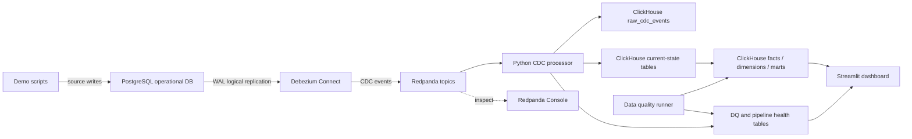

# Architecture

ShopPulse uses PostgreSQL as the operational source of truth. Debezium reads logical changes from the PostgreSQL WAL and publishes one topic per table into Redpanda. A Python processor consumes those CDC events, stores raw payloads, maintains ClickHouse current-state tables, and feeds dashboard-ready views.

The architecture is intentionally small enough to run locally, but the responsibilities mirror a production CDC platform: source capture, durable event transport, incremental processing, analytical serving, dashboarding, quality checks, and observability.

## Services

| Service | Responsibility |
|---|---|
| PostgreSQL | Source e-commerce transactions |
| Debezium | CDC capture from PostgreSQL WAL |
| Redpanda | Kafka-compatible event transport |
| Redpanda Console | Topic and consumer group inspection |
| Python processor | Debezium parsing, validation, ClickHouse writes |
| ClickHouse | Real-time analytical serving |
| Streamlit | Dashboard and demo interface |

## Data Flow

1. Demo scripts write transactions into PostgreSQL.
2. Debezium emits snapshot rows with `op = r`, then streaming changes with `c`, `u`, and `d`.
3. Redpanda stores the table topics.
4. The processor writes every event to `raw_cdc_events`.
5. The processor writes latest row images into `cur_*` tables using immutable inserts.
6. ClickHouse views expose dimensions, facts, and marts.
7. Streamlit queries ClickHouse for real-time dashboards.
8. Quality checks validate analytical assumptions and write results to the health layer.

## Diagram



## Topic Naming

Debezium emits one topic per source table:

```text
dbserver1.public.customers
dbserver1.public.sellers
dbserver1.public.products
dbserver1.public.inventory
dbserver1.public.stock_movements
dbserver1.public.orders
dbserver1.public.order_items
dbserver1.public.payments
dbserver1.public.shipments
dbserver1.public.refunds
```

## ClickHouse Layers

| Layer | Example objects | Purpose |
|---|---|---|
| Raw CDC | `raw_cdc_events` | Audit trail and replay/debug context |
| Current state | `cur_orders`, `cur_inventory`, `cur_payments` | Latest row images with CDC metadata |
| Facts/dimensions | `fact_orders`, `dim_products`, `dim_sellers` | Analytics-friendly semantic layer |
| Marts | `mart_executive_overview`, `mart_realtime_inventory` | Dashboard-ready outputs |
| Health | `pipeline_event_log`, `data_quality_results` | Trust and observability layer |

## Design Rationale

- PostgreSQL remains focused on operational writes.
- Debezium avoids application-level polling and captures changes from WAL.
- Redpanda decouples producers and consumers and gives the demo a visible event backbone.
- Python keeps the MVP implementation readable and interview-friendly.
- ClickHouse provides fast analytical reads over CDC-derived tables.
- Streamlit keeps the dashboard practical and easy to run locally.
